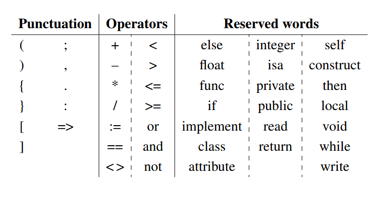
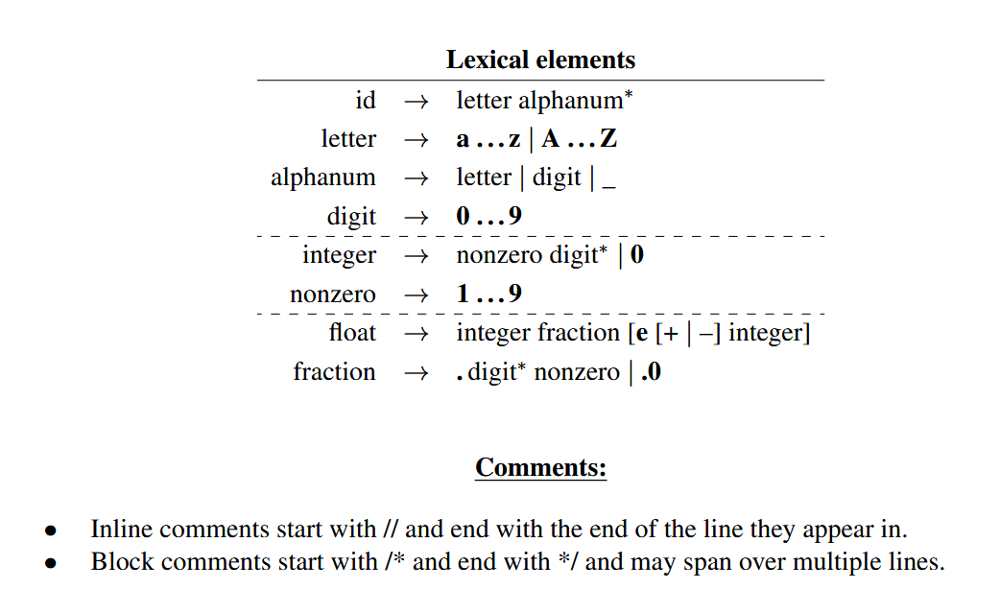

# Compiler_Design_EEX6363
Compiler design to understand how the Lexical analysis, Syntax analysis and Semantic analysis carries out in compilation process after pre-process stage during the execution of a language translator of a computer.

# TMA 1 - To design the Lexical analyser using flex and bison
- compile using below commands
	* flex tma_1_lex.l
	* bison -y -d -v .\tma_1_yc.y
	* gcc -c y.tab.c lex.yy.c
	* gcc lex.yy.c y.tab.c -o tma_1.exe
- Run tma_1.exe
	* .\tma_1.exe
- Enter any of the defined lexeme as the input

## The syntax and grammar

- Desin and implement a lexical anlayzer for a programming language whose speci-
fications are given below. 
- The scanner identifies and outputs tokens (valid words and punctuation)
in the source program. Its output is a token that can thereafter be used by the syntax analyzer to verify that the program is syntactically valid. When called, the lexical analyzer should extract the next token from the source program.

## Full Paper

